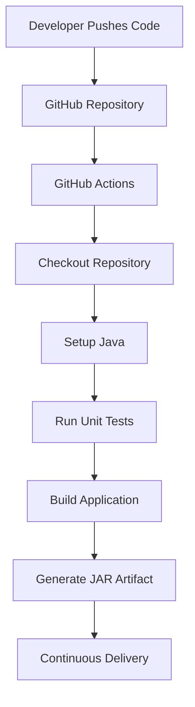
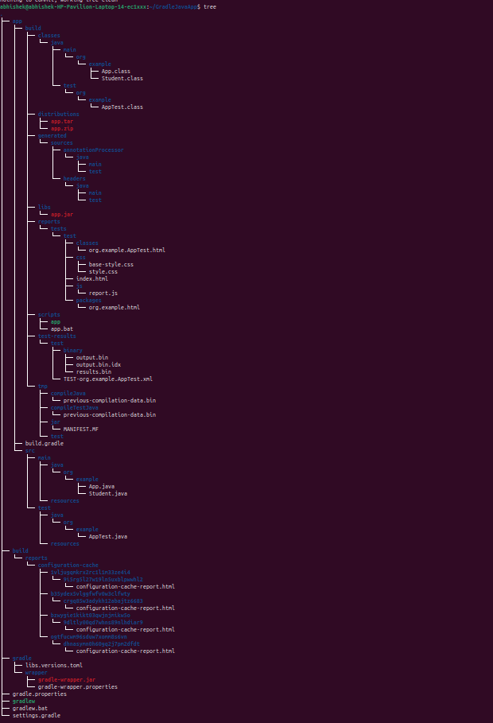
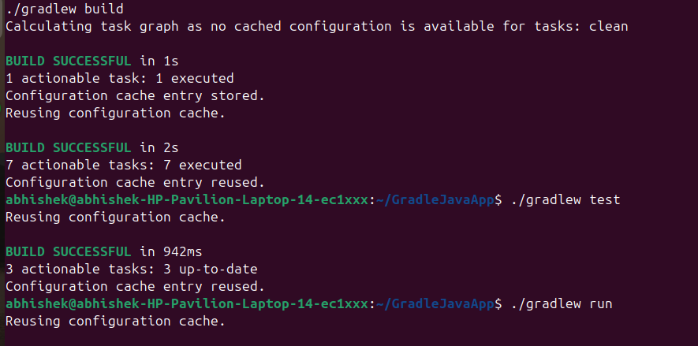
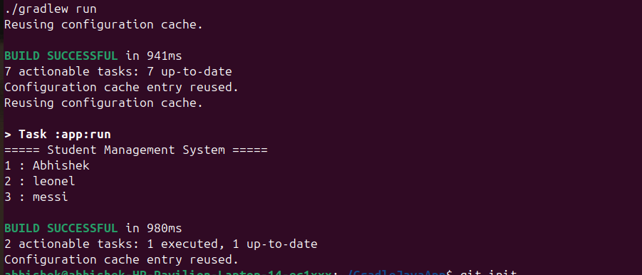
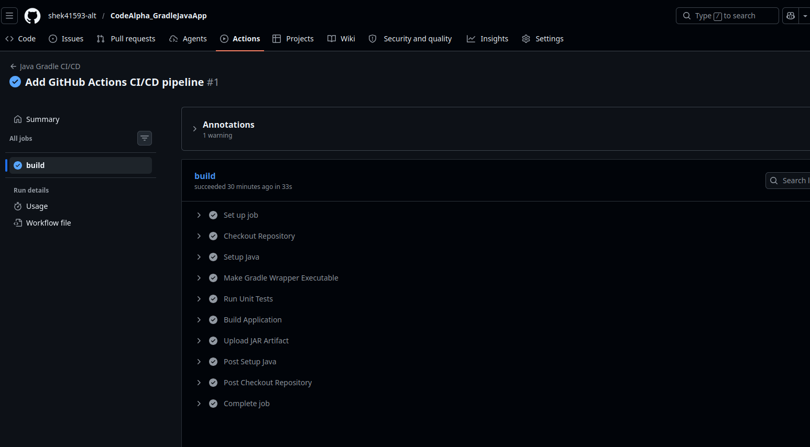
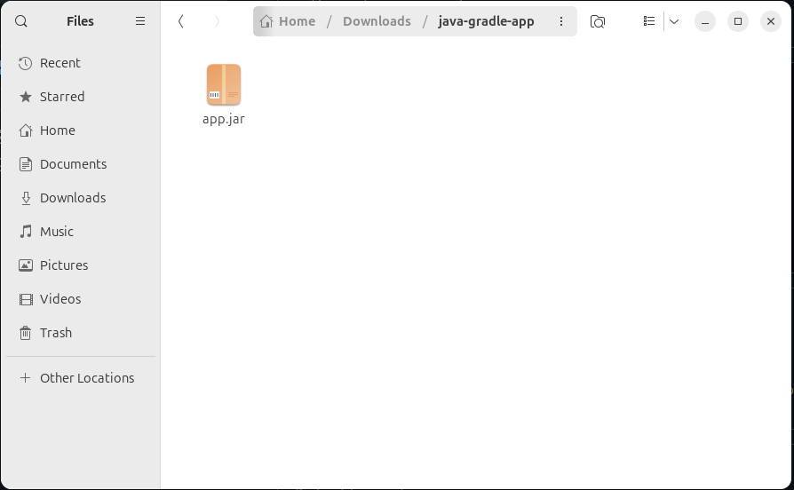

# Java Application using Gradle with CI/CD Pipeline

## CodeAlpha Internship - Task 3


---

# Project Overview

This project demonstrates the implementation of a Java application using Gradle as the build automation tool. The project showcases dependency management, automated testing, artifact generation, and Continuous Integration/Continuous Delivery (CI/CD) using GitHub Actions.

The application is a simple Student Management System that manages student records and demonstrates Java development integrated with modern DevOps practices.

---

# Objectives

* Automate Java project builds using Gradle.
* Manage dependencies efficiently.
* Implement Continuous Integration using GitHub Actions.
* Generate deployable JAR artifacts automatically.
* Understand and apply DevOps practices in Java development.

---

# Technologies Used

| Technology     | Purpose                 |
| -------------- | ----------------------- |
| Java 21        | Application Development |
| Gradle 8.14.3  | Build Automation        |
| JUnit 5        | Unit Testing            |
| Git            | Version Control         |
| GitHub         | Source Code Management  |
| GitHub Actions | CI/CD Automation        |

---

# Project Structure

```text
CodeAlpha_GradleJavaApp
│
├── .github
│   └── workflows
│       └── gradle.yml
│
├── app
│   ├── build.gradle
│   ├── src
│   │   ├── main
│   │   │   └── java
│   │   │       └── org
│   │   │           └── example
│   │   │               ├── App.java
│   │   │               └── Student.java
│   │   │
│   │   └── test
│   │       └── java
│   │           └── org
│   │               └── example
│   │                   └── AppTest.java
│   │
│   └── build
│
├── gradle
│   └── wrapper
│
├── gradlew
├── gradlew.bat
├── settings.gradle
├── gradle.properties
├── .gitignore
└── README.md
```

---

# System Architecture

```text
┌─────────────────┐
│   Developer     │
└────────┬────────┘
         │
         ▼
┌─────────────────┐
│ GitHub Repository│
└────────┬────────┘
         │ Push Code
         ▼
┌─────────────────┐
│ GitHub Actions  │
│  CI/CD Pipeline │
└────────┬────────┘
         │
 ┌───────┼─────────┐
 ▼       ▼         ▼
Test   Build    Package
(JUnit)(Gradle) (JAR)
         │
         ▼
┌─────────────────┐
│ app.jar Artifact│
└─────────────────┘
```

---

# CI/CD Workflow



---

# Application Features

* Create Student Objects
* Store Student Records
* Display Student Information
* Automated Unit Testing
* Automated Build Process
* Automated Artifact Generation

---

# Build Commands

### Clean Project

```bash
./gradlew clean
```

### Build Project

```bash
./gradlew build
```

### Run Tests

```bash
./gradlew test
```

### Run Application

```bash
./gradlew run
```

---

# Sample Output

```text
===== Student Management System =====

1 : Abhishek
2 : leonel
3 : messi
```

---

# Dependency Management

Gradle manages external dependencies automatically through Maven Central.

Example dependency:

```gradle
implementation libs.guava
```

Benefits:

* Automatic dependency resolution
* Version management
* Faster builds through caching
* Reproducible builds

---

# CI/CD Pipeline Stages

The GitHub Actions workflow performs:

1. Checkout Repository
2. Setup Java Environment
3. Execute Unit Tests
4. Build Application
5. Generate JAR Artifact
6. Upload Build Artifact

---

# Screenshots

## Project Structure

[📁 View Project Structure](screenshots/01-project-structure.png)



---

## Gradle Build Success

[📁 View Build Screenshot](screenshots/02-gradle-build-success.png)



---

## Application Output

[📁 View Run Output](screenshots/03-application-run-output.png)



---

## GitHub Actions Success

[📁 View CI/CD Pipeline](screenshots/04-github-actions-success.png)



---

## Artifact Generation

[📁 View Artifact Screenshot](screenshots/05-artifact-upload.png)



---

# Test Report

JUnit reports are automatically generated under:

```text
app/build/reports/tests/test/
```

---

# Deliverables Achieved

✅ Java Application Development

✅ Build Automation using Gradle

✅ Dependency Management

✅ Unit Testing

✅ JAR Artifact Generation

✅ GitHub Repository Integration

✅ GitHub Actions CI/CD Pipeline

✅ Continuous Delivery Workflow

✅ DevOps Best Practices

---

# Conclusion

This project successfully demonstrates Java application development integrated with Gradle build automation and GitHub Actions CI/CD. The implementation automates building, testing, packaging, and artifact generation while showcasing core DevOps principles and modern software delivery practices.
